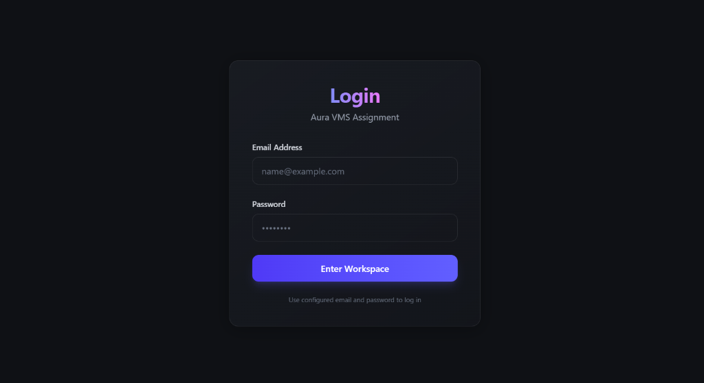
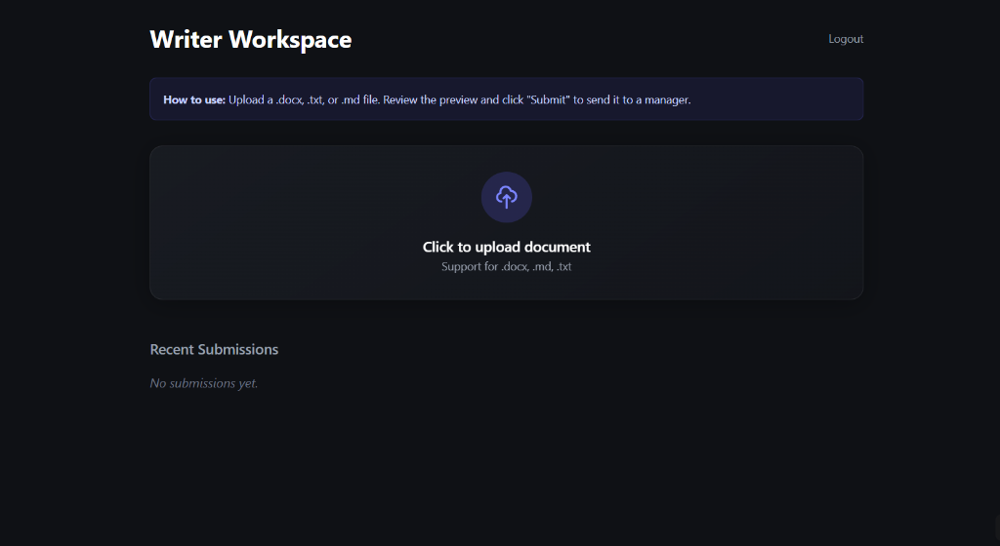
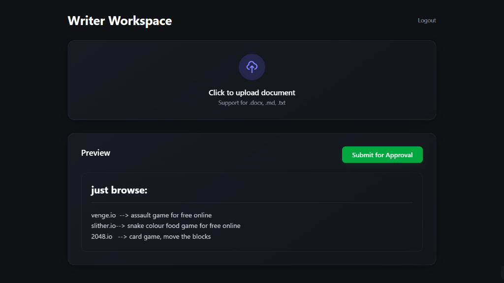
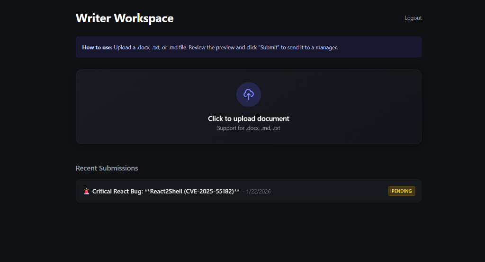
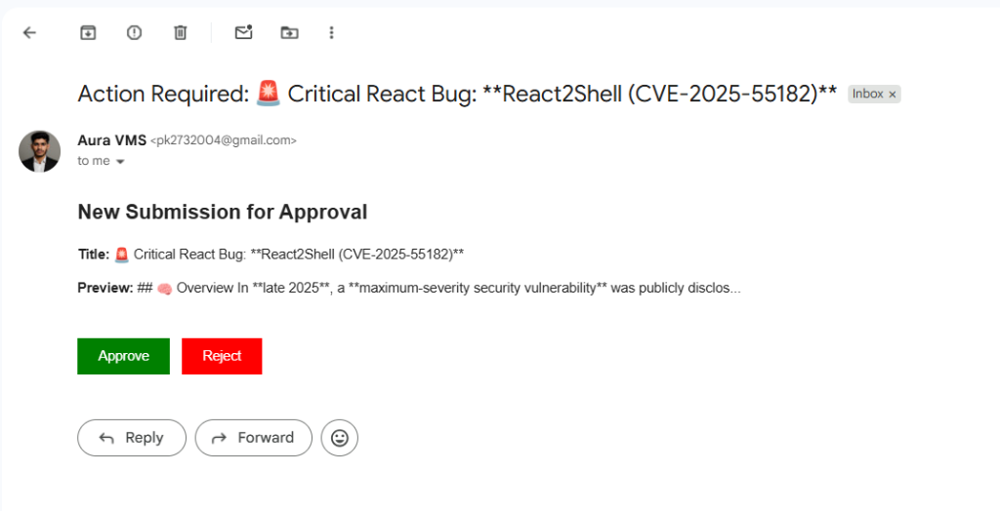
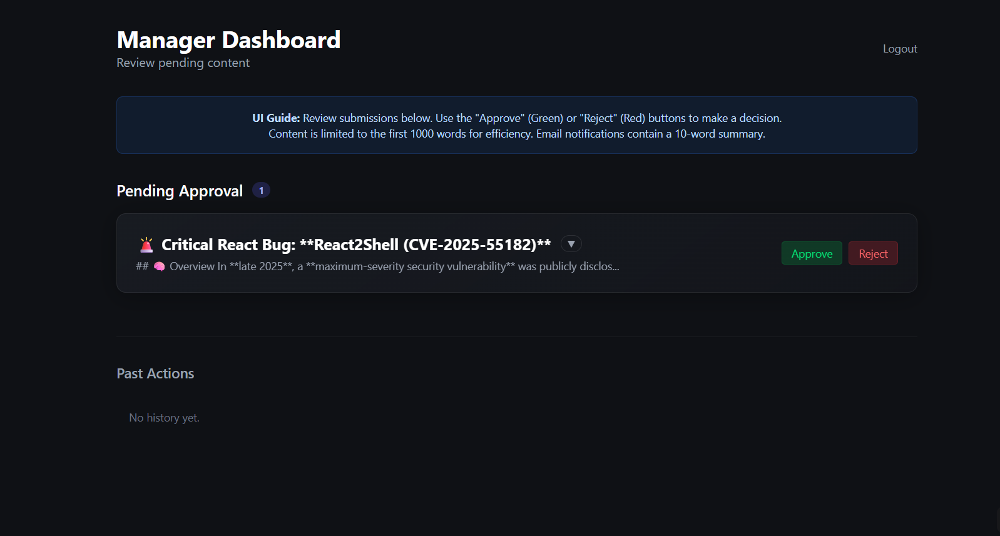

# Aura VMS SDE Internship Assignment

This Assignment is a professional Vendor Management System designed to facilitate efficient document submission and approval workflows. It serves as a centralized platform connecting Writers and Managers, ensuring a streamlined process for content review. The application is built with a focus on performance, security, and a premium user experience.

## Application Walkthrough

### 1. Login Page
The application features a secure entry point with role-based access control. Users identify as either a `writer` or `manager` to access their dedicated workspaces.


### 2. Writer Workspace
Upon successful authentication, Writers are presented with a focused dashboard designed for productivity. The interface is clean and optimized for initiating new submissions.


### 3. Document Upload & Preview
Writers can upload documents (supporting .docx, .md, .txt). The system parses the content and generates an immediate preview, allowing for verification before final submission.


### 4. Submission Status
Once a document is submitted, its status is tracked in real-time. Writers can verify that their work is "Pending" review directly from their dashboard.


### 5. Manager Notification
Managers receive automated email notifications containing the full submission details. These emails include direct action buttons to "Approve" or "Reject" the submission without needing to navigate back to the dashboard.


### 6. Manager Dashboard
*Feature currently in development.* Future updates will include a dedicated Manager Dashboard to view historical data, track approved/rejected requests, and manage remaining queue items.


## Tests

To ensure system reliability and code quality, the project includes a comprehensive test suite using Jest. These tests validate core functionalities including document parsing, database operations, and API endpoints.

To run the tests:
```bash
npm test
```

## Installation & Setup

Follow these steps to set up the project locally:

1.  **Clone the Repository**
    ```bash
    git clone <repository-url>
    cd aura_vms
    ```

2.  **Install Dependencies**
    ```bash
    npm install
    ```

3.  **Configure Environment Variables**
    Create a `.env.local` file in the root directory to configure local settings (such as email credentials).
    ```env
    # Example configuration
    EMAIL_USER=your-email@example.com
    EMAIL_PASS=your-app-password
    ```

4.  **Run the Development Server**
    Start the application in development mode:
    ```bash
    npm run dev
    ```
    The application will be accessible at `http://localhost:3000`.

---
Thanks for reading, hope you like it!
